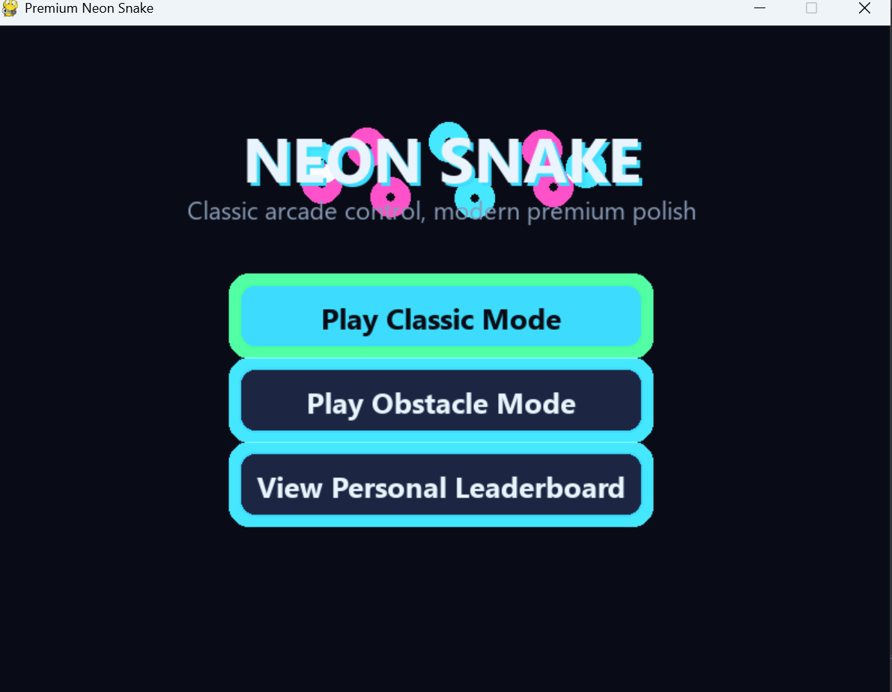
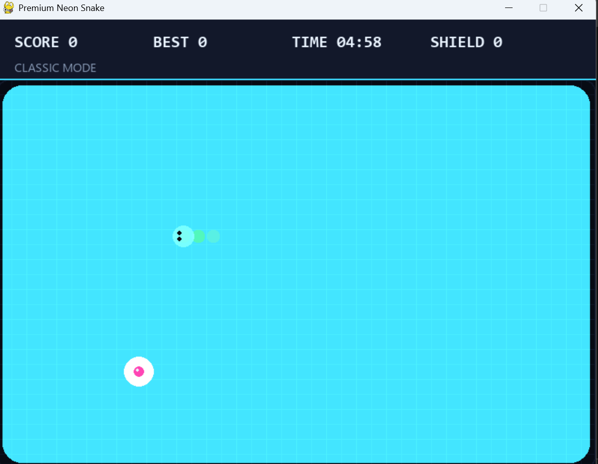
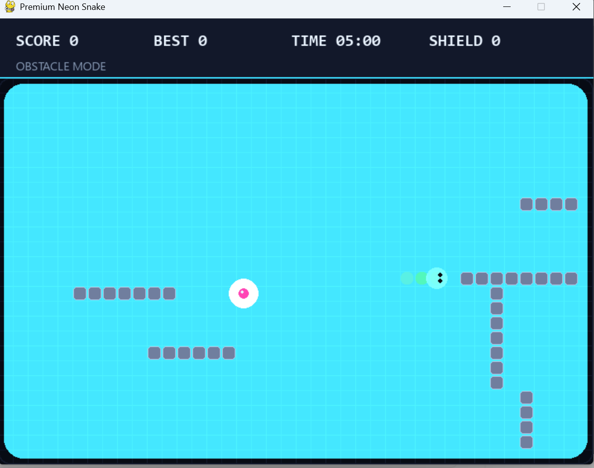

# 🐍 Premium Neon Snake

一款使用 Python + Pygame 构建的现代霓虹风贪吃蛇桌面游戏。项目目标是先做好一个稳定、漂亮、可运行的单机 v1 版本，再为后续云端排行榜、Web 版本和多人协作开发做准备。



## 🔗 作者相关项目

- [Interactive Particle CV - v2-analysis-improvements](https://github.com/wwwyh007/Interactive-Particle-CV/tree/v2-analysis-improvements)：基于 C++17、OpenGL、OpenCV 的实时手势粒子交互项目。这个 Snake 项目会延续同样的 GitHub 展示风格：清晰说明、预览图、运行指南、后续路线和协作入口。

## 💡 项目亮点

- **现代街机视觉**：深色背景、高对比霓虹色、发光食物、平滑按钮 hover 效果。
- **双模式玩法**：Classic Mode 保留经典体验，Obstacle Mode 加入随机障碍墙提升策略性。
- **5 分钟倒计时局制**：每局 300 秒，适合挑战个人最佳成绩。
- **特殊奖励机制**：Classic Mode 中有 10% 概率生成大红点，可能获得护盾或 +30 秒时间奖励。
- **护盾/额外生命**：撞墙或撞到自己时，护盾会抵消死亡并触发短暂无敌反馈。
- **本地排行榜**：`leaderboard.json` 保存个人前 5 名成绩和时间戳，后续可替换为 Web API。
- **面向协作的结构**：用 OOP 分离游戏逻辑、渲染 UI、分数持久化，方便后续贡献者扩展。

## 🖼️ 游戏预览

以下图片存放在 `docs/images/`，GitHub 打开 README 时会自动显示。

### 🎮 Main Menu


### 🕹️ Classic Mode



### 🧱 Obstacle Mode



## 📦 发布素材

- `docs/images/premium-neon-snake-menu.png`：README 顶部封面与主菜单预览。
- `docs/images/premium-neon-snake-classic.png`：Classic Mode 游戏画面预览。
- `docs/images/premium-neon-snake-obstacle.png`：Obstacle Mode 障碍玩法预览。
- 后续可以继续加入 `docs/images/` 或 `docs/demo/`，用于展示 Game Over、演示视频和 GitHub Release 素材。

## 🛠️ 技术栈

- **语言**：Python 3.13+
- **游戏框架**：Pygame 2.6.1
- **界面风格**：Neon-retro / modern arcade
- **数据存储**：本地 JSON 文件
- **开发环境**：Visual Studio / VS Code / PowerShell

## 🌐 Web Alpha

仓库中的 `web/` 是浏览器原生版本，使用 React、TypeScript 和 HTML Canvas 构建。目前包含 Classic / Obstacle 双模式、五套可选蛇皮肤、键盘与触屏控制、倒计时、护盾奖励、D1 全局排行榜和个人历史最高记录。

```powershell
cd web
npm install
npm run dev
```

Web Alpha 与原来的 Pygame 桌面版并存，当前采用匿名玩家别名保存成绩，账号系统留到后续版本。

## 🚀 快速运行

```powershell
git clone https://github.com/wwwyh007/Premium-Neon-Snake.git
cd Premium-Neon-Snake

python -m venv .venv
.\.venv\Scripts\activate
python -m pip install -r requirements.txt
python premium_snake.py
```

如果你已经在 Windows 上安装了 Python，也可以直接运行：

```powershell
python -m pip install -r requirements.txt
python premium_snake.py
```

## 🧑‍💻 Visual Studio 运行方式

1. 打开 Visual Studio Installer。
2. 点击 Visual Studio 的 **Modify**。
3. 勾选 **Python development** 工作负载。
4. 打开本项目文件夹，或者打开 `PremiumSnake.sln`。
5. 在 Python Environments 中选择 Python 3.13+ 环境。
6. 安装依赖：

```powershell
python -m pip install -r requirements.txt
```

7. 设置 `premium_snake.py` 为启动文件，按 `F5` 运行。

## 🎯 操作方式

- 方向键 / `WASD`：控制蛇移动
- 鼠标：点击菜单按钮
- `Esc`：退出游戏

## 📁 项目结构

```text
PremiumSnake/
├── premium_snake.py          # 游戏主程序：逻辑、UI、排行榜持久化
├── requirements.txt          # Python 依赖
├── PremiumSnake.sln          # Visual Studio 解决方案
├── PremiumSnake.pyproj       # Visual Studio Python 项目文件
├── docs/
│   └── images/
│       ├── premium-neon-snake-menu.png
│       ├── premium-neon-snake-classic.png
│       └── premium-neon-snake-obstacle.png
├── OPEN_ME_FIRST.txt         # 本地打开和运行说明
├── RUN_GAME.bat              # Windows 双击运行脚本
└── .gitignore                # 忽略本地环境、缓存、排行榜等文件
```

运行后生成的 `leaderboard.json` 是个人本地数据，不建议提交到仓库。

## 🧠 架构说明

- `ScoreManager`：负责读取、排序、写入本地排行榜，未来可以替换为云端 API。
- `GameSession`：维护单局游戏状态，包括蛇、食物、障碍、分数、倒计时和护盾。
- `Renderer`：集中处理画面绘制、HUD、菜单、排行榜和 Game Over 页面。
- `Button`：封装可复用的交互按钮和 hover 反馈。
- `ObstacleManager`：负责障碍模式中的随机墙块生成。

## 🗺️ 后续路线

- **v1.0 Desktop Stable**：稳定桌面版、完善 README、整理发布版本。
- **v1.1 Polish**：加入音效、暂停菜单、设置页、难度选择、更多动画反馈。
- **v1.2 Code Split**：把单文件拆分为 `game/`、`ui/`、`storage/` 等模块。
- **v2.0 Cloud Ready**：排行榜接入 Web API，支持账号、在线分数同步。
- **v2.1 Web Version**：探索 Pygame CE / Pyodide / Web 前端复刻版本。

## 🌿 分支规划

- `main`：稳定可运行版本。
- `dev`：日常整合分支，用于合并多个功能开发。
- `feature/<name>`：新功能分支，例如 `feature/sound-effects`。
- `fix/<name>`：Bug 修复分支。
- `docs/<name>`：文档和截图更新分支。

## 🤝 参与贡献

欢迎提交 Issue、建议玩法、优化 UI、修复 Bug 或改进代码结构。请先阅读 [CONTRIBUTING.md](CONTRIBUTING.md)。

适合新贡献者的方向：

- 增加音效和背景音乐。
- 增加暂停菜单和设置界面。
- 优化障碍物生成规则。
- 添加更多特殊食物效果。
- 为 `ScoreManager` 编写测试。
- 将单文件项目逐步拆分成模块。

## 📄 License

This project is open source under the [MIT License](LICENSE).
